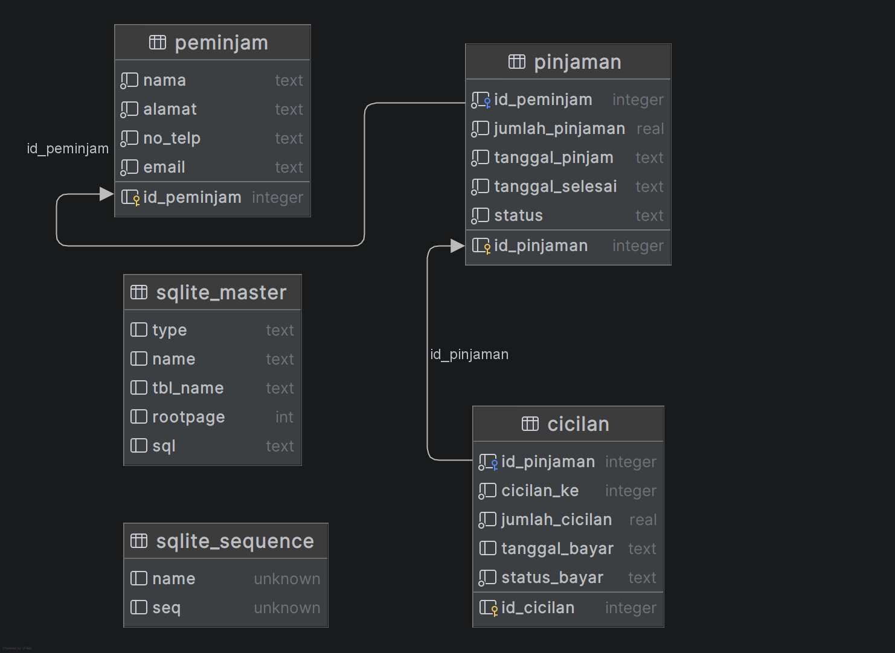

# 💰 Sistem Informasi Simpan Pinjam Pemerintah Desa

Aplikasi desktop untuk mengelola data simpan pinjam uang dengan fitur lengkap CRUD (Create, Read, Update, Delete) menggunakan Python dan PyQt6.

## 📋 Deskripsi Project

Sistem informasi untuk mengelola transaksi pinjaman uang, data peminjam, dan cicilan pembayaran di lingkungan pemerintah desa. Aplikasi ini dibangun dengan konsep database relasional dan mengimplementasikan best practices dalam pengembangan aplikasi desktop.

## 👥 Informasi Kelompok

### Anggota Kelompok
| No | Nama | NIM           | Peran |
|----|------|--------------|-------|
| 1 | Yohanes Oktanio | 240411100095 | Ketua Kelompok |
| 2 | Muhammad Fajar Nugroho | 240411100103 | Anggota |
| 3 | Muhammad Rafi Lazuardi | 230411100060 | Anggota |
| 4 | Ahmad Ubaydir Rohman | 230411100116 | Anggota |

### Detail Mata Kuliah
- **Kelas**: IF 7D
- **Mata Kuliah**: Pemrograman Desktop
- **Dosen**:  Yonathan Ferry Hendrawan, S.T., M.IT.
- **Topik**:  Simpan Pinjam Uang
- **Semester**:  2025/2026 Gasal

## 🎯 Fitur Utama

### 1. Table View (Tab 1) - Filter & Display
- ✅ Menampilkan data gabungan dari 3 tabel dengan JOIN query
- ✅ Filter berdasarkan **Nama Peminjam** (text input dengan real-time search)
- ✅ Filter berdasarkan **Status Pinjaman** (dropdown:  Semua/Aktif/Lunas/Belum Bayar)
- ✅ Format currency otomatis untuk kolom nominal (Rp 5.000.000)
- ✅ Sortable columns - klik header untuk sorting
- ✅ Auto-refresh saat data berubah

### 2. Record View (Tab 2) - CRUD Operations
- ✅ **Navigasi Record**:  
  - First (<<) - Record pertama
  - Previous (<) - Record sebelumnya
  - Next (>) - Record berikutnya
  - Last (>>) - Record terakhir
- ✅ **CRUD Operations**:
  - **Tambah**: Menambah record baru ke database
  - **Edit**: Mengubah data existing record
  - **Hapus**: Menghapus record dengan konfirmasi
  - **Simpan**: Commit perubahan ke database
  - **Batal**: Rollback perubahan yang belum disimpan
- ✅ Switch antar tabel (Peminjam/Pinjaman/Cicilan)
- ✅ Form input dengan validation
- ✅ QDataWidgetMapper untuk data binding

## 🗂️ Struktur Database

### Entity Relationship Diagram (ERD)



### Tabel-tabel

#### 1. Tabel `peminjam` (5 records)
| Field       | Type    | Constraint    | Deskripsi |
|-------------|---------|---------------|-----------|
| id_peminjam | INTEGER | PRIMARY KEY AUTOINCREMENT | ID unik peminjam |
| nama        | TEXT    | NOT NULL      | Nama lengkap peminjam |
| alamat      | TEXT    | NOT NULL      | Alamat lengkap |
| no_telp     | TEXT    | NOT NULL      | Nomor telepon |
| email       | TEXT    | NOT NULL      | Email peminjam |

#### 2. Tabel `pinjaman` (6 records)
| Field           | Type    | Constraint    | Deskripsi |
|-----------------|---------|---------------|-----------|
| id_pinjaman     | INTEGER | PRIMARY KEY AUTOINCREMENT | ID unik pinjaman |
| id_peminjam     | INTEGER | FOREIGN KEY → peminjam.id_peminjam | Referensi ke peminjam |
| jumlah_pinjaman | REAL    | NOT NULL      | Total pinjaman |
| tanggal_pinjam  | TEXT    | NOT NULL      | Tanggal pinjaman dibuat |
| tanggal_selesai | TEXT    | NOT NULL      | Target tanggal selesai |
| status          | TEXT    | NOT NULL      | Status: Aktif/Lunas |

#### 3. Tabel `cicilan` (24 records)
| Field          | Type    | Constraint    | Deskripsi |
|----------------|---------|---------------|-----------|
| id_cicilan     | INTEGER | PRIMARY KEY AUTOINCREMENT | ID unik cicilan |
| id_pinjaman    | INTEGER | FOREIGN KEY → pinjaman.id_pinjaman | Referensi ke pinjaman |
| cicilan_ke     | INTEGER | NOT NULL      | Urutan cicilan (1-6) |
| jumlah_cicilan | REAL    | NOT NULL      | Nominal per cicilan |
| tanggal_bayar  | TEXT    | NULL          | Tanggal pembayaran (null jika belum) |
| status_bayar   | TEXT    | NOT NULL      | Status:  Lunas/Belum Bayar |

### Relasi
- **1:N** - Satu peminjam dapat memiliki banyak pinjaman
- **1:N** - Satu pinjaman dapat memiliki banyak cicilan

## 📁 Struktur File Project

```
simpan-pinjam-pemdes/
├── main.py                 # Entry point aplikasi (QMainWindow + QTabWidget)
├── create_database.py      # Script inisialisasi database dan sample data
├── database_manager.py     # Class untuk koneksi database
├── table_view.py           # Widget Table View dengan filter
├── record_view.py          # Widget Record View dengan CRUD
├── add_data_dialog.py      # Dialog untuk tambah data baru
├── database.db             # SQLite database (auto-generated)
├── ERD.png                 # Entity Relationship Diagram
├── table_view.png          # Screenshot Table View
├── record_view.png         # Screenshot Record View
├── LICENSE.txt             # MIT License
└── README.md               # Dokumentasi project
```

## 🚀 Cara Instalasi dan Menjalankan

### Prerequisites
- Python 3.9 atau lebih baru
- pip (Python package installer)

### Langkah Instalasi

1. **Clone repository ini**
   ```bash
   git clone https://github.com/Buthzz/simpan-pinjam-pemdes.git
   cd simpan-pinjam-pemdes
   ```

2. **Install dependencies**
   ```bash
   pip install PyQt6
   ```

3. **Jalankan aplikasi**
   ```bash
   python main.py
   ```
   
   > **Note**: Database akan otomatis dibuat saat pertama kali menjalankan aplikasi jika `database.db` belum ada.

### Membuat Ulang Database (Optional)

Jika ingin reset database dengan sample data:
```bash
python create_database.py
```

Output: `✅ Database berhasil dibuat: database.db`

## 🎨 Tech Stack

| Teknologi | Versi  | Kegunaan |
|-----------|--------|----------|
| Python | 3.9+   | Bahasa pemrograman utama |
| PyQt6 | Latest | GUI Framework untuk desktop application |
| SQLite | 3      | Embedded database engine |
| QSqlDatabase | -      | Qt database connectivity layer |
| QSqlTableModel | -      | Model untuk operasi CRUD |
| QSqlQueryModel | -      | Model untuk display data dengan JOIN |
| QDataWidgetMapper | -      | Data binding antara model dan widgets |

## 📚 Konsep yang Diimplementasikan

### Dari Materi Kuliah Pemrograman Desktop
- ✅ **QTableView & QSqlQueryModel** - Menampilkan data tabel dengan custom query
- ✅ **Multi-parameter Search** - Filter dengan multiple conditions
- ✅ **Signal & Slots** - textChanged untuk auto-filter, currentChanged untuk navigasi
- ✅ **QFormLayout** - Layout 2 kolom untuk form input
- ✅ **QDataWidgetMapper** - Mapping antara database columns dan form widgets
- ✅ **Navigation Controls** - First, Previous, Next, Last record navigation
- ✅ **CRUD Interface** - Create, Read, Update, Delete operations
- ✅ **Database Authentication** - Koneksi SQLite dengan QSqlDatabase

### Fitur Tambahan & Best Practices
- ✅ **Custom Delegate** - CurrencyDelegate untuk format Rp
- ✅ **Foreign Key Handling** - QComboBox dengan data dari relasi
- ✅ **Input Validation** - QDateEdit untuk tanggal, ComboBox untuk enum
- ✅ **Error Handling** - Try-catch pada database operations
- ✅ **UI/UX Modern** - CSS styling, grouping dengan QGroupBox
- ✅ **Confirmation Dialog** - Konfirmasi sebelum delete record
- ✅ **Auto Database Creation** - Check dan create database otomatis

## ✅ Checklist Requirements UAS

| No | Requirement | Status | Implementation |
|----|-------------|--------|----------------|
| 1 | Minimal 2 tabel | ✅ | 3 tabel: peminjam, pinjaman, cicilan |
| 2 | Minimal 5 record per tabel | ✅ | Peminjam(5), Pinjaman(6), Cicilan(24) |
| 3 | Dibuat dengan SQL | ✅ | CREATE TABLE & INSERT dengan raw SQL |
| 4 | Relasi Primary-Foreign Key | ✅ | FK: pinjaman→peminjam, cicilan→pinjaman |
| 5 | 1 file Python untuk demo | ✅ | main.py (modular dengan import) |
| 6 | Table View + 2 filter | ✅ | Filter nama & status dengan real-time signal |
| 7 | Per-record view + navigasi | ✅ | 4 tombol navigasi (<<, <, >, >>) |
| 8 | Fungsi edit & tambah | ✅ | CRUD lengkap dengan QDataWidgetMapper |

## 🖼️ Screenshot

### Tab 1: Table View - Filter & Display


**Fitur:**
- JOIN 3 tabel (peminjam, pinjaman, cicilan)
- Real-time filter berdasarkan nama dan status
- Format currency untuk nominal
- Sortable columns

### Tab 2: Record View - CRUD Operations


**Fitur:**
- Form input dengan data binding
- Navigasi antar record (First, Prev, Next, Last)
- Tombol CRUD (Tambah, Edit, Hapus, Simpan, Batal)
- Switch antar tabel

## 🔧 Troubleshooting

### Database tidak terbuat
Jalankan manual script create database:
```bash
python create_database.py
```

### Error "No module named 'PyQt6'"
Install dependency:
```bash
pip install PyQt6
```

### Aplikasi tidak bisa dibuka
Pastikan Python versi 3.9+: 
```bash
python --version
```

## 📄 Lisensi

Project ini dilisensikan di bawah [MIT License](LICENSE.txt).

Dibuat untuk keperluan akademis (UAS Pemrograman Desktop) oleh Kelompok IF 7D.

---

**Dibuat dengan ❤️ oleh Kelompok IF 7D**  
**Tech Stack:  Python 3.9+ | PyQt6 | SQLite**

*Universitas Trunojoyo Madura*  
*Semester Gasal 2025/2026*

*Last updated: 10 Desember 2025*