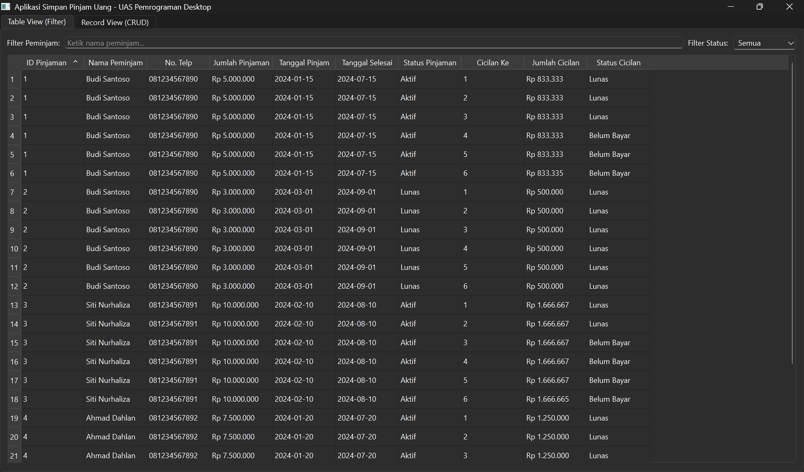
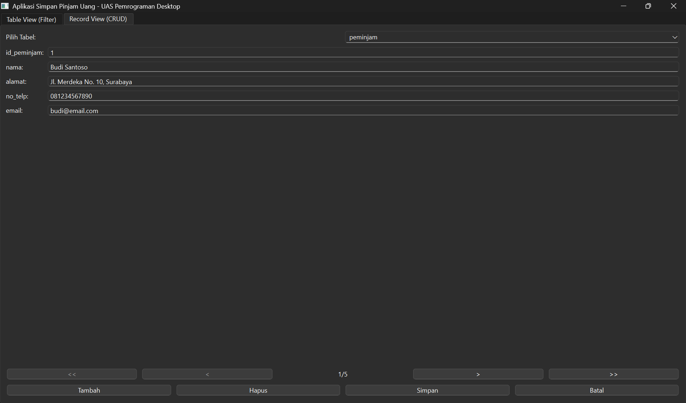

# 💰 Aplikasi Simpan Pinjam Uang

Aplikasi desktop untuk mengelola data simpan pinjam uang dengan fitur lengkap CRUD (Create, Read, Update, Delete) menggunakan Python dan PyQt6.

## 📋 Deskripsi Project

Project UAS Pemrograman Desktop ini adalah sistem informasi untuk mengelola transaksi pinjaman uang, data peminjam, dan cicilan pembayaran. Aplikasi ini dibangun dengan konsep database relasional dan interface yang user-friendly.

## 👥 Informasi Kelompok

### Anggota Kelompok
| No | Nama | NRP | Peran |
|----|------|-----|-------|
| 1 | Yohanes Oktanio | 240411100095 | Ketua Kelompok |
| 2 | Muhammad Fajar Nugroho | 240411100103 | Anggota |
| 3 | Muhammad Rafi Lazuardi | 230411100060 | Anggota |
| 4 | Ahmad Ubaydir Rohman | 230411100116 | Anggota |

### Detail Mata Kuliah
- **Kelas**: IF 7D
- **Mata Kuliah**: Pemrograman Desktop
- **Dosen**: Yonathan Ferry Hendrawan, S.T., M.IT.
- **Topik**: Simpan Pinjam Uang
- **Semester**: 2025/2026 Gasal

## 🎯 Fitur Utama

### 1. Table View (Tab 1)
- ✅ Menampilkan data gabungan dari 3 tabel (JOIN)
- ✅ Filter berdasarkan **Nama Peminjam** (input text)
- ✅ Filter berdasarkan **Status** (dropdown: Semua/Aktif/Lunas/Belum Bayar)
- ✅ Real-time filtering saat mengetik
- ✅ Format currency untuk nominal uang (Rp 5.000.000)
- ✅ Sortable columns (klik header untuk sort)

### 2. Record View (Tab 2)
- ✅ **Navigasi Record**: First, Previous, Next, Last
- ✅ **CRUD Operations**:
  - **Tambah**: Menambah record baru
  - **Edit**: Mengubah data existing
  - **Hapus**: Menghapus record dengan konfirmasi
  - **Simpan**: Menyimpan perubahan ke database
  - **Batal**: Membatalkan perubahan
- ✅ Switch antar tabel (Peminjam/Pinjaman/Cicilan)
- ✅ Form input yang ergonomis dengan QDataWidgetMapper

## 🗂️ Struktur Database

### Entity Relationship Diagram (ERD)


### Tabel-tabel

#### 1. Tabel `peminjam` (5 records)
| Field       | Type    | Constraint    |
|-------------|---------|---------------|
| id_peminjam | INTEGER | PRIMARY KEY   |
| nama        | TEXT    | NOT NULL      |
| alamat      | TEXT    | NOT NULL      |
| no_telp     | TEXT    | NOT NULL      |
| email       | TEXT    | NOT NULL      |

#### 2. Tabel `pinjaman` (6 records)
| Field           | Type    | Constraint    |
|-----------------|---------|---------------|
| id_pinjaman     | INTEGER | PRIMARY KEY   |
| id_peminjam     | INTEGER | FOREIGN KEY → peminjam.id_peminjam |
| jumlah_pinjaman | REAL    | NOT NULL      |
| tanggal_pinjam  | TEXT    | NOT NULL      |
| tanggal_selesai | TEXT    | NOT NULL      |
| status          | TEXT    | NOT NULL      |

#### 3. Tabel `cicilan` (24 records)
| Field          | Type    | Constraint    |
|----------------|---------|---------------|
| id_cicilan     | INTEGER | PRIMARY KEY   |
| id_pinjaman    | INTEGER | FOREIGN KEY → pinjaman.id_pinjaman |
| cicilan_ke     | INTEGER | NOT NULL      |
| jumlah_cicilan | REAL    | NOT NULL      |
| tanggal_bayar  | TEXT    | NULL          |
| status_bayar   | TEXT    | NOT NULL      |

### Relasi
- **1:N** - Satu peminjam dapat memiliki banyak pinjaman
- **1:N** - Satu pinjaman dapat memiliki banyak cicilan

## 📁 Struktur File Project

```
simpan_pinjam_uang/
├── create_database.py      # Script untuk membuat database
├── database.db             # Database SQLite (generated)
├── database_manager.py     # Class manajemen database
├── table_view.py           # Widget untuk Table View + Filter
├── record_view.py          # Widget untuk Record View + CRUD
├── main.py                 # File utama aplikasi ⭐
└── README.md               # Dokumentasi project
```

## 🚀 Cara Instalasi dan Menjalankan

### Prerequisites
- Python 3.9 atau lebih baru
- pip (Python package installer)

### Langkah Instalasi

1. **Clone atau download project ini**
   ```bash
   cd simpan-pinjam-pemdes
   ```

2. **Install dependencies**
   ```bash
   pip install PyQt6
   ```

3. **Buat database (jalankan sekali)**
   ```bash
   python create_database.py
   ```
   Output: `✅ Database berhasil dibuat!`

4. **Jalankan aplikasi**
   ```bash
   python main.py
   ```

## 🎨 Tech Stack

| Teknologi | Versi  | Kegunaan |
|-----------|--------|----------|
| Python | 3.9+   | Bahasa pemrograman utama |
| PyQt6 | Latest | GUI Framework |
| SQLite | 3      | Database engine |
| QSqlDatabase | -      | Database connectivity |
| QSqlTableModel | -      | Model untuk CRUD |
| QSqlQueryModel | -      | Model untuk display |
| QDataWidgetMapper | -      | Mapping data ke widgets |

## 📚 Konsep yang Diimplementasikan

### Dari Materi Kuliah (Slide 12)
- ✅ **QTableView & QSqlQueryModel** - Untuk menampilkan data tabel
- ✅ **3 Parameter Search** - Filter dengan multiple fields
- ✅ **Signal textChanged** - Update query otomatis
- ✅ **QFormLayout** - Layout 2 kolom untuk form
- ✅ **QDataWidgetMapper** - Mapping kolom database ke widget
- ✅ **Navigation Controls** - First, Prev, Next, Last buttons
- ✅ **CRUD Interface** - Create, Read, Update, Delete
- ✅ **Database Authentication** - Koneksi ke SQLite dengan QSqlDatabase

### Fitur Tambahan
- ✅ **Custom Delegate** - Format currency untuk nominal
- ✅ **Foreign Key Handling** - Dropdown untuk relasi tabel
- ✅ **Input Validation** - DateEdit untuk tanggal, ComboBox untuk status
- ✅ **UI/UX Modern** - Styling dengan CSS, grouping, icons

## ✅ Checklist Requirements UAS

| No | Requirement | Status | Keterangan |
|----|-------------|--------|------------|
| 1 | Minimal 2 tabel | ✅ | 3 tabel: peminjam, pinjaman, cicilan |
| 2 | Minimal 5 record per tabel | ✅ | Peminjam(5), Pinjaman(6), Cicilan(24) |
| 3 | Dibuat dengan SQL | ✅ | CREATE TABLE & INSERT dengan SQL |
| 4 | Relasi Primary-Foreign Key | ✅ | FK: pinjaman→peminjam, cicilan→pinjaman |
| 5 | 1 file Python untuk demo | ✅ | main.py (mengimport module lain) |
| 6 | Table View + 2 filter | ✅ | Filter nama & status dengan signal |
| 7 | Per-record view + navigasi | ✅ | <<, <, >, >> buttons |
| 8 | Fungsi edit & tambah | ✅ | CRUD lengkap dengan QDataWidgetMapper |

## 🖼️ Screenshot

### Tab 1: Table View

Menampilkan semua transaksi dengan filter real-time.

### Tab 2: Record View

Form untuk mengelola data dengan navigasi record.

## 📄 Lisensi

Project ini dibuat untuk keperluan akademis (UAS Pemrograman Desktop) oleh kelompok 5.

---

**Dibuat dengan ❤️ oleh Kelompok 5**  
**Menggunakan Python & PyQt6**

*Universitas Trunojoyo Madura*  
*Semester Ganjil 2025/2026*

*Last updated: 2 Desember 2025*